# data-glue

   

## Pitfall

The `receiveValue` have to deal with various types, including:

1. raw **value**
2. inflated **value**
3. inflated **proxy** (points to another node)

Therefore, you need to fulfill this procedure so you can distinguish them:

```mermaid
flowchart TD;

  start(get `newValue`) 
    --> raw_check{{"🤔 `newValue` is raw value? "}}

  raw_check 
    -- Yes, It's Raw 
    --> done1[ return `newValue` ]

  raw_check 
    -- No, it's inflated
    --> proxy_check

  proxy_check{{ `newValueIsProxied`  ?}}

  proxy_check 
    -- Yes, it's a proxy
    --> a

  proxy_check 
    -- No, it's not
    --> update_store
  
    update_store("ff")

```

